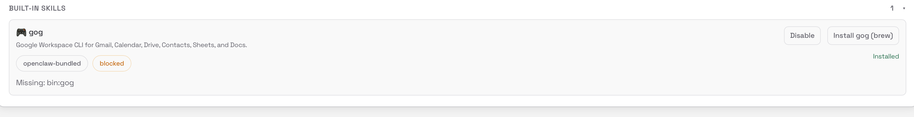

# Steps: OpenClaw

https://github.com/aws-samples/sample-OpenClaw-on-AWS-with-Bedrock?tab=readme-ov-file

1. Create EC-Keypair for SSH
2. Run the CloudFormation template in your AWS Account in your desired location.
3. Install Session manager Plugin:

```bash
#For MAC - apple silicon:
curl "https://s3.amazonaws.com/session-manager-downloads/plugin/latest/mac_arm64/session-manager-plugin.pkg" -o "session-manager-plugin.pkg"
```

1. Run the install commands. If the command fails, verify that the`/usr/local/bin` folder exists. If it doesn't, create it and run the command again.

```bash
sudo installer -pkg session-manager-plugin.pkg -target /
sudo ln -s /usr/local/sessionmanagerplugin/bin/session-manager-plugin /usr/local/bin/session-manager-plugin
```

https://docs.aws.amazon.com/systems-manager/latest/userguide/install-plugin-macos-overview.html

1. Connect to the EC2 Instance:

    ```bash
    aws ssm start-session --target <your-instance-id> --region eu-west-1
    ```


1. Switch to ubuntu user:

    ```bash
    sudo su ubuntu
    ```


1. Install Kiro, you CLI Helper (https://kiro.dev/downloads/)

```bash
curl -fsSL https://cli.kiro.dev/install | bash
```

1. Add kiro-cli to the path:

    ```bash
    echo 'export PATH="$PATH:/home/ubuntu/.local/bin"' >> ~/.bashrc
    source ~/.bashrc
    ```


1. Authenticate kiro with your AWS Builder Id or Google or Github Account:

```bash
kiro-cli login --use-device-flow
```

**For Kiro-Cli**

```bash
aws ssm start-session --target <your-instance-id>  --region eu-west-1 --document-name AWS-StartPortForwardingSession --parameters '{"portNumber":["3128"],"localPortNumber":["3128"]}'
```

### Installing `gog-cli`:

Setup password for ubuntu:

```bash
sudo passwd ubuntu
```

Install Brew:

```bash
/bin/bash -c "$(curl -fsSL https://raw.githubusercontent.com/Homebrew/install/HEAD/install.sh)"
```

```bash
echo 'eval "$(/home/linuxbrew/.linuxbrew/bin/brew shellenv)"' >> ~/.bashrc
source ~/.bashrc
```

**For OpenClaw**

```bash
aws ssm start-session --target <your-instance-id>  --region eu-west-1 --document-name AWS-StartPortForwardingSession --parameters '{"portNumber":["18789"],"localPortNumber":["28789"]}'
```

Run dashboard:

```bash
openclaw dashboard
```

Copy the URL:

`http://localhost:18789/?token=<token>`

Change the port to our local port:

`http://localhost:28789/?token=<token>`

Go to UI:

<click on install>



## Step 6: Verify Installation

Check `gog` is installed correctly

```bash
gog --version
```

## Step 7: Verify OpenClaw Recognizes gog

Confirm the gog skill shows as "ready"

```bash
openclaw skills list | grep gog
```

## Step 8: Get Google OAuth Credentials

Create OAuth 2.0 Desktop credentials from Google Cloud Console and download the JSON file

Open: https://console.cloud.google.com/apis/credentials

Download `config.json` to `~/`

Dont forget to publish the app (under Audience)

## Step 9: Store OAuth Credentials

Tell `gog` where your credentials file is

```bash
gog auth credentials ~/config.json
```

## Step 10: Authenticate Google Account

Add your Google account in manual mode - it will give you a URL to open elsewhere

```bash
echo 'export GOG_KEYRING_PASSWORD="<your-password>"' >> ~/.bashrc
source ~/.bashrc
```

```bash
gog auth add your-email@gmail.com --manual
```

## Step 11: Set Default Account

Set default account to avoid repeating --account flag

```bash
echo 'export GOG_ACCOUNT=your-email@gmail.com' >> ~/.bashrc
source ~/.bashrc
```

## Step 12: Test Gmail

Verify authentication works

```bash
gog gmail labels list
```

## Step 13: Test Calendar

Verify calendar access works

```bash
gog calendar calendars
```

Create environment file at `~/.openclaw/.env`:

```bash
GOG_ACCOUNT=your.email@gmail.com
GOG_KEYRING_PASSWORD=your_password
```
