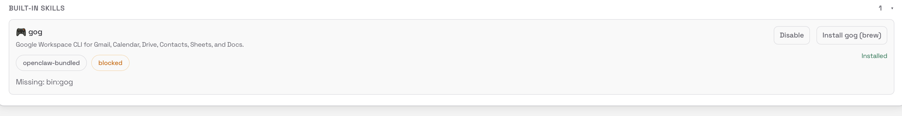

# Deploy OpenClaw on AWS with Google & WhatsApp Automation

Reference repository: https://github.com/aws-samples/sample-OpenClaw-on-AWS-with-Bedrock?tab=readme-ov-file

---

## Step 1: Create EC2 Key Pair

Create an EC2 key pair for SSH access in your AWS Console.

---

## Step 2: Deploy CloudFormation Template

Run the CloudFormation template in your AWS account in your desired region.

---

## Step 3: Install AWS Session Manager Plugin

**macOS (Apple Silicon):**

```bash
curl "https://s3.amazonaws.com/session-manager-downloads/plugin/latest/mac_arm64/session-manager-plugin.pkg" -o "session-manager-plugin.pkg"
sudo installer -pkg session-manager-plugin.pkg -target /
sudo ln -s /usr/local/sessionmanagerplugin/bin/session-manager-plugin /usr/local/bin/session-manager-plugin
```

> If the install command fails, verify that `/usr/local/bin` exists. If it doesn't, create it and re-run.

**macOS (Intel):**

```bash
curl "https://s3.amazonaws.com/session-manager-downloads/plugin/latest/mac/sessionmanagerplugin.pkg" -o "session-manager-plugin.pkg"
sudo installer -pkg session-manager-plugin.pkg -target /
sudo ln -s /usr/local/sessionmanagerplugin/bin/session-manager-plugin /usr/local/bin/session-manager-plugin
```

**Linux (64-bit):**

```bash
curl "https://s3.amazonaws.com/session-manager-downloads/plugin/latest/ubuntu_64bit/session-manager-plugin.deb" -o "session-manager-plugin.deb"
sudo dpkg -i session-manager-plugin.deb
```

**Windows:** Download and run the installer from the [AWS documentation](https://docs.aws.amazon.com/systems-manager/latest/userguide/install-plugin-windows.html).

Full reference: https://docs.aws.amazon.com/systems-manager/latest/userguide/install-plugin-macos-overview.html

---

## Step 4: Connect to the EC2 Instance

```bash
aws ssm start-session --target <your-instance-id> --region eu-west-1
```

---

## Step 5: Switch to Ubuntu User

```bash
sudo su ubuntu
```

---

## Step 6: Install Kiro CLI

Reference: https://kiro.dev/downloads/

```bash
curl -fsSL https://cli.kiro.dev/install | bash
```

Add Kiro CLI to your PATH:

```bash
echo 'export PATH="$PATH:/home/ubuntu/.local/bin"' >> ~/.bashrc
source ~/.bashrc
```

---

## Step 7: Authenticate Kiro CLI

```bash
kiro-cli login --use-device-flow
```

---

## Step 8: Set Up Port Forwarding

Open **two new terminal tabs/windows on your local machine** and run each command in its own tab. Keep them running throughout the session.

**Tab 1 — Kiro CLI proxy:**

```bash
aws ssm start-session --target <your-instance-id> --region eu-west-1 \
  --document-name AWS-StartPortForwardingSession \
  --parameters '{"portNumber":["3128"],"localPortNumber":["3128"]}'
```

**Tab 2 — OpenClaw dashboard:**

```bash
aws ssm start-session --target <your-instance-id> --region eu-west-1 \
  --document-name AWS-StartPortForwardingSession \
  --parameters '{"portNumber":["18789"],"localPortNumber":["28789"]}'
```

---

## Step 9: Install gog-cli

Back in your EC2 session, set a password for the ubuntu user (required by Homebrew):

```bash
sudo passwd ubuntu
```

Install Homebrew:

```bash
/bin/bash -c "$(curl -fsSL https://raw.githubusercontent.com/Homebrew/install/HEAD/install.sh)"
```

Add Homebrew to your PATH:

```bash
echo 'eval "$(/home/linuxbrew/.linuxbrew/bin/brew shellenv)"' >> ~/.bashrc
source ~/.bashrc
```

Install gog-cli via Homebrew:

```bash
brew install gog-cli
```

---

## Step 10: Open the OpenClaw Dashboard

Run the dashboard:

```bash
openclaw dashboard
```

Copy the URL printed in the terminal:

```
http://localhost:18789/?token=<token>
```

Replace the port with your local forwarded port:

```
http://localhost:28789/?token=<token>
```

Open that URL in your browser and click **Install**.



---

## Step 11: Verify Installation

Check `gog` is installed correctly:

```bash
gog --version
```

Confirm the gog skill shows as "ready" in OpenClaw:

```bash
openclaw skills list | grep gog
```

---

## Step 12: Get Google OAuth Credentials

1. Open https://console.cloud.google.com/apis/credentials
2. Create **OAuth 2.0 Desktop** credentials
3. Download the JSON file and save it to `~/config.json`
4. Under **Audience**, publish the app (required for OAuth to work)

---

## Step 13: Register OAuth Credentials with gog

```bash
gog auth credentials ~/config.json
```

---

## Step 14: Set Keyring Password and Authenticate Google Account

Set a keyring password (used to encrypt the stored OAuth token):

> **Security note:** Storing the password in `.bashrc` is convenient but keeps it as plaintext on disk. For higher security, set `GOG_KEYRING_PASSWORD` only for your current session (`export GOG_KEYRING_PASSWORD="..."`) or use a secrets manager.

```bash
echo 'export GOG_KEYRING_PASSWORD="<your-password>"' >> ~/.bashrc
source ~/.bashrc
```

Add your Google account (manual mode provides a URL to open in your browser):

```bash
gog auth add your-email@gmail.com --manual
```

---

## Step 15: Set Default Account

Avoid repeating `--account` on every command:

```bash
echo 'export GOG_ACCOUNT=your-email@gmail.com' >> ~/.bashrc
source ~/.bashrc
```

---

## Step 16: Test Gmail

Verify authentication works:

```bash
gog gmail labels list
```

---

## Step 17: Test Google Calendar

Verify calendar access works:

```bash
gog calendar calendars
```

---

## Step 18: Configure OpenClaw Environment File

Create `~/.openclaw/.env` so OpenClaw can use your credentials when running automations:

```bash
GOG_ACCOUNT=your.email@gmail.com
GOG_KEYRING_PASSWORD=your_password
```

---

## Step 19: WhatsApp Integration

> Coming soon — WhatsApp setup steps will be added here.

---
